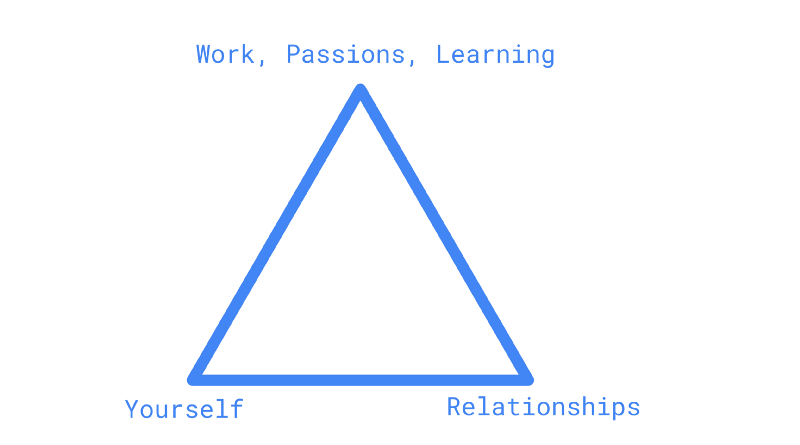

Over the past year, I’ve been reflecting a lot on how I can live my life in a way that I’ll be happy, knowing my constraints, my desires, and my values. After going through many reflections based on some recent experiences that had deep emotional impacts on me, I’ve finally come to a description of life that I’m satisfied with for now.

From my limited observation, it seems like meditation has taken a resurgence in popular culture in different forms, a practice that people in many cultures have been doing since ancient times. Something we don’t teach in modern culture broadly anymore is what it means to have discipline and why constraints are actually liberating, not the other way around. We look at people that choose not to partake in things like drinking, doing drugs, casual sex, or partying, and see them as people that are “missing out”. Discipline is freeing in many different ways — some of which being clarity of focus, execution, thought, and control over your emotions.

I’ve come to recognize meditation, not as some morning 10-minute exercise, but a lens through which you view life. Put another way, I think you should live life as though you’re always trying to be in a meditative state. I’m mangling the word “meditation” and expanding the definition here, but bear with me. Often, when I imagine someone living out their lives in a meditative state, I imagine someone in a jungle, renouncing the rest of the world, meditating. Basically, something that is unreachable to someone like me who wants to live in normal society.

Credit to: [https://www.awesomenesssauce.com/wp-content/uploads/2018/03/tmnt\_meditation.jpg](https://www.awesomenesssauce.com/wp-content/uploads/2018/03/tmnt_meditation.jpg)

Never fear — I believe there is actually an answer to how you can live in a meditative state, even while living a normal life. I’m going to look at some actionable things you can do across the three most important dimensions of your life to reach a better state.

These are the three categories that I’m roughly defining as things you need to improve within to reach a better state of mind. I think these three categories apply to a lot of people, if not almost everyone.

With yourself, I think the most important thing you can do is start developing good habits and discipline. One way to think about this is even doing the simplest things better every day — eat healthily, sleep well, exercise properly, avoid alcohol and drugs, be practically frugal, etc. I also have found that it’s incredibly valuable to be off social media as much as possible. The world’s knowledge is described in some of the most well-known books, while we continue to fill ourselves with garbage on social media every day.

With relationships, I’ve found that what works best for me is to spend most of my time with people I care about and that value me, spend a little bit of time as needed on people that I interact with but not necessarily because we have some kind of meaningful relationship, and spend as little or zero time on people that don’t value me and/or treat me like garbage. I got this horribly wrong in the past, almost inverting the prior sentence. To no surprise, I was unhappy as a result. I won’t ever be doing that again. If I’m by myself as a result, so be it. On that note, also recognize that other people have value. People are not Costco samples or tools to satiate your desires. Value the people in your life. One example of something I think has gone completely backward is modern dating/relationship culture, but that’s a topic for another day.

With work, learning, passions, and things of that nature, I’ve learned that you have to put yourself in a position where you are doing things you really enjoy. It doesn’t feel as much like work when you enjoy it — but also, it’s super hard to get into a flow state if you hate what you’re doing or are extremely apathetic to everything you do. A lot of your life is spent working, and doing the work to be great at your craft comes at a cost — often a social one, as you will often choose sleep, peace of mind, and hard work over having a social life. But I find that cost is totally worth it in the long-term, as long as you’re willing to accept the consequences that come with this cost.

Notice how nothing I described is profound, or honestly, super interesting. What I’ve noticed is that few actually implement these things into their life. When you get the fundamentals wrong, everything else goes out of whack. Young people I’ve known often look for their dopamine hits, but I’m making the argument now that you don’t have to constantly look for the high highs or low lows — live in the middle. Sure, maybe I’ll never experience extreme happiness, but I don’t experience extreme sadness either. It’s not half bad this way 😄

Something I’ve discovered over the past year is that the simpler I’ve made my life, and the more I focus on the good people in my life (and zero on the bad), I’ve become calm and collected with no additional effort. After developing a habit of doing what I described above consistently as of recent, I’ve found that my mental state feels like a series of meditations. It’s not about what you include in your life, but all the things that you exclude that help you reach a calm state of mind. I don’t feel the need to meditate as a practice on its own — because my entire life is one.